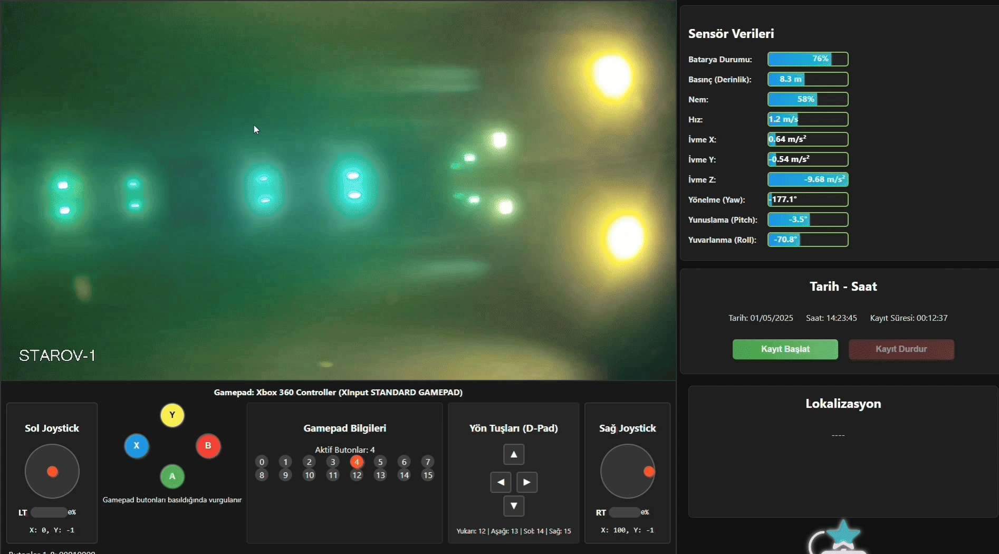

<div align="center">

# STAROV-1 Ground Control Station (GCS)

**A high-performance, low-latency desktop interface built to pilot and monitor the STAROV-1 underwater vehicle.**

[](https://youtu.be/S7FXlory1yk)


*Real-time interface capturing Gamepad input, IMU telemetry, and MJPEG video streaming.*

</div>

---

## 📌 Overview
This directory contains the complete source code for the **STAROV-1 Ground Control Station**. Designed for operational reliability, this Electron-based desktop application serves as the central hub between the human operator and the STM32-based embedded systems on the ROV.

It handles three critical concurrent tasks without blocking the main thread:
1. **Real-time 60fps hardware polling** via the HTML5 Gamepad API.
2. **High-frequency UDP bidirectional telemetry** to and from the STM32 microcontroller.
3. **Live video transcoding and streaming** bridging an RTSP camera feed to an HTML-compatible MJPEG stream.

---

## 🏗️ System Architecture & Data Flow

To ensure zero-latency piloting, the application is structured into decoupled micro-processes:

* **The UI Thread (Renderer Process):** Pure Vanilla JavaScript, HTML, and CSS. Chosen specifically to avoid the overhead of frontend frameworks (React/Vue) and guarantee frame-perfect UI updates and Gamepad polling via `requestAnimationFrame`.
* **The IPC Bridge (`preload.js`):** Implements strict Context Isolation. The frontend cannot access Node.js directly; it communicates via a heavily restricted, custom API surface for security.
* **The Hardware Thread (Main Process):** Manages raw Node.js `dgram` UDP sockets. It listens for IMU/Sensor data on Port `25011` and broadcasts Gamepad state to the STM32 on Port `25010` at 50Hz.
* **The Video Microservice (`server.js`):** A standalone Express.js server spawned as a child process. Since browsers cannot natively render RTSP streams, this microservice uses **FFmpeg** to capture the ROV's camera feed, transcode it into a continuous MJPEG boundary stream, and pipe it locally to the frontend.

---

## 💻 Tech Stack
* **Framework:** Electron (Node.js + Chromium)
* **Frontend:** Vanilla JS, HTML5, CSS3
* **Backend:** Express.js, FFmpeg (Child Process management)
* **Networking:** UDP (`dgram`), IPC (Inter-Process Communication)
* **Hardware Interfacing:** HTML5 Gamepad API

---

## 🚀 Key Engineering Features

### 🎮 Custom Controller Mapping
Built a robust polling loop that maps raw X/Y axis data and bitwise-encoded button arrays into a standardized 8-byte UDP packet, ensuring lightweight and instantaneous transmission to the embedded logic.

### 📊 Real-Time Telemetry Dashboard
Dynamic visual rendering of real-time sensor data, including:
* 6-Axis IMU visualization (Roll, Pitch, Yaw, Acceleration)
* Depth (Pressure) and Humidity mapping


### 🛡️ Process Lifecycle Management
Implemented fail-safes to ensure that when the Electron app is closed, all child processes (like the Express video server and FFmpeg transcoder) and UDP sockets are gracefully killed and unreferenced to prevent memory leaks or zombie processes.

---

# STAROV-1 UI Installation Guide

## 🛠️ Step 1: Prerequisites

Before running the application, your computer needs two pieces of background software to run the code and process the live camera video feed.

1. **Install Node.js:**
   * Go to [nodejs.org](https://nodejs.org/) and download the "LTS" (Long Term Support) version. 
   * Run the installer and just click "Next" through all the standard options.
   
2. **Install FFmpeg (Crucial for the camera stream):**
   * **Windows:** Open your terminal (Command Prompt) and paste: `winget install ffmpeg`
   * **Mac:** Open your terminal and paste: `brew install ffmpeg`
   * **Linux (Ubuntu/Debian):** Open your terminal and paste: `sudo apt install ffmpeg`

---

## 🚀 Step 2: Download and Install the Interface

Once Node.js and FFmpeg are installed, open your terminal (Command Prompt on Windows, Terminal on Mac/Linux) and follow these copy-paste steps.

**1. Download the code to your computer:**
Paste this command and press **Enter**:
```bash
git clone https://github.com/geometricus-briareus/STAROV-1.git
```
**2. Go into the User Interface folder:**

Paste this command and press Enter:
```bash
cd STAROV-1/Station-UI
```
**3. Install the required background packages:**

Paste this command and press Enter (this might take a minute or two to finish):
```bash
npm install
```

## 🎮 Step 3: Start the Application

Whenever you want to launch the STAROV-1 interface, just open your terminal, make sure you are inside the Station-UI folder, and run this single command:
```bash
npm start
```

A new window will open automatically displaying the STAROV-1 dashboard, and the local video server will start running in the background to catch the camera feed!